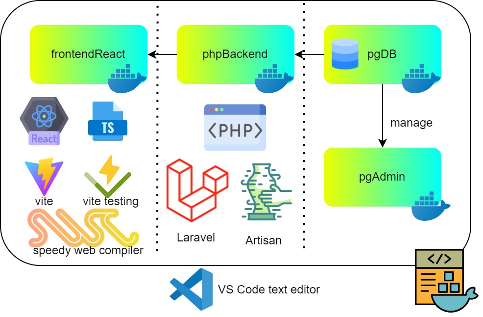

### What is it about ?
project ของผมคือการร้อยเรียงจาก datamodel จากหนังสือ universal datamodel resource book vol1 ให้กลายเป็นระบบ full stack เเละมีการทำ test driven design ทดสอบการทำงานในทุกๆ unit เพื่อเป็นกรณีศึกษา ให้คนอื่นได้นำวิธีที่ผมทำไปทำเป็นหลักสูตรการเรียนรู้วิชาวิศวะกรรม software ได้

### Architecture
ALL NEW PHP เป็นการนำ php ที่เป็นภาษาเก่าเเก่เเต่ทรงอนุภาค มาติดอาวุธที่ทันสมัย อย่างเช่น postgresql React+Ts เเละ Laravel framework ที่มาครอบ PHP อีกชั้นนึงเพื่อความสดวก

ตามจริงมี nginx เป็น load balancer ด้วยเเต่ผมไม่รู้จะเอามาใส่ตรงใหนของ diagram ผมเลยไม่ใส่

### artifacts (pptx)
https://docs.google.com/presentation/d/1oNFU5xwg3WIrw60VAQ8mE4_KBbktYMX0/edit?usp=sharing&ouid=106810446332487814657&rtpof=true&sd=true

### dependencies
มีเเค่ docker ก็พอ

### เนื้อหาเพิ่มเติม
อยู่ใน /note/...